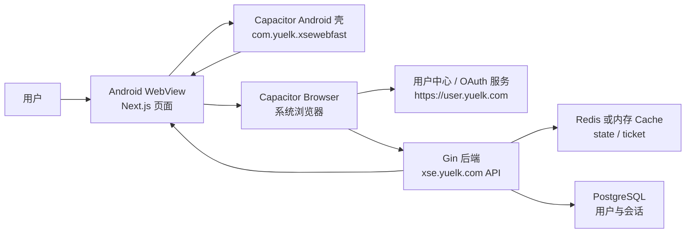
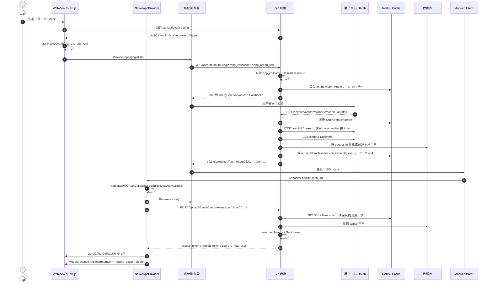
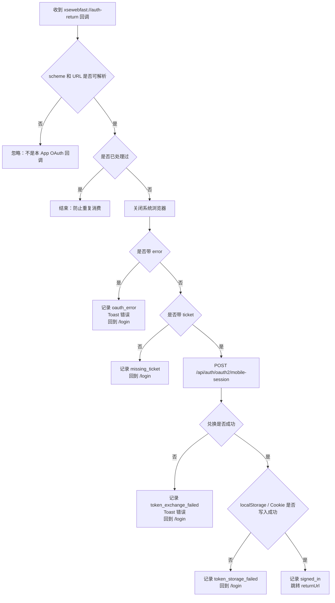

# Android 登录接入流程说明

本文说明 `App/Android` 的登录接入全流程。当前 Android App 是 Capacitor 原生壳，加载远程 Next.js 站点；登录由 WebView 内页面发起，在系统浏览器完成 OAuth / Google 授权，然后通过自定义 scheme 带一次性 ticket 回到 App，最后由 WebView 向后端兑换正式会话。

核心结论：

- Android 原生层不保存账号、Cookie、access token 或 refresh token。
- App 回调只携带两分钟有效、一次性消费的 `ticket`，不在 deep link URL 中暴露访问令牌。
- 真正的登录态由后端签发 Cookie / token，再由 WebView 内前端写入 Cookie、localStorage 和内存状态。
- 新接入优先使用 `xsewebfast://auth-return` + `/api/auth/oauth2/mobile-session` 这一套 ticket bridge。
- 仓库里还保留了旧的 PKCE App handoff：`xsewebfast://oauth/callback` + `/api/auth/oauth2/app-token`。这是兼容链路，新 Android 快速版不要作为首选接入。

## 角色与职责



| 角色 | 主要职责 | 对应实现 |
|---|---|---|
| Android 原生壳 | 配置 WebView、Cookie、deep link intent-filter、网络诊断 | `android/app/src/main/AndroidManifest.xml`、`MainActivity.java`、`YuemDiagnosticWebViewClient.java` |
| WebView 前端 | 展示登录页、发起 native OAuth、监听 scheme 回调、兑换 ticket、保存登录态 | `front-end-nextjs/src/components/auth/login-form.tsx`、`src/lib/native-app.ts`、`src/components/providers/native-app-provider.tsx` |
| 后端 Gin | 创建 OAuth state、处理 OAuth callback、生成一次性 ticket、兑换正式会话 | `backend-gin/internal/http/handlers/matrix_auth_oauth.go`、`matrix_auth_oauth_mobile.go` |
| 用户中心 / OAuth | 完成用户登录授权，向后端 Web callback 返回 `code` 和 `state` | `https://user.yuelk.com/oauth2.1/authorize`、`/token`、`/userinfo` |
| Redis / Cache | 保存 OAuth `state` 和移动端 `ticket` | `oauth2:state:<state>`、`oauth2:mobile-session:<sha256(ticket)>` |

## 关键地址与常量

| 项 | 当前值 | 说明 |
|---|---|---|
| Android package | `com.yuelk.xsewebfast` | `capacitor.config.ts` 和 `strings.xml` 中保持一致 |
| App 名称 | `月梦-快速版` | Android launcher / build 展示名 |
| WebView 站点 | `https://xse.yuelk.com` | `CAP_SERVER_URL` 或 `NEXT_PUBLIC_YUEM_MOBILE_SERVER_URL` 控制 |
| 自定义 scheme | `xsewebfast` | AndroidManifest 通过 `@string/custom_url_scheme` 注册 |
| 新版 native callback | `xsewebfast://auth-return` | 当前主链路，用于 ticket bridge |
| Web OAuth callback | `https://xse.yuelk.com/api/auth/oauth2/callback` | OAuth 服务端只需要允许这个 Web 回调 |
| 登录入口 | `GET /api/auth/oauth2/login` | 前端点击登录后打开 |
| OAuth Web 回调 | `GET /api/auth/oauth2/callback` | 用户中心带 `code/state` 回后端 |
| App 会话兑换 | `POST /api/auth/oauth2/mobile-session` | WebView 用 ticket 换 Cookie / token |
| Ticket TTL | `2 分钟` | 过期或重复兑换都会失败 |
| OAuth state TTL | `10 分钟` | 防 CSRF，callback 时消费一次 |

## 总体时序图



## 详细接入流程

### 1. App 启动并加载远程站点

`App/Android/capacitor.config.ts` 决定 WebView 加载哪个站点：

```ts
server: {
  url: serverUrl,
  cleartext: isCleartextServer,
  allowNavigation: navigationHosts,
  errorPath: "offline.html",
}
```

服务地址优先级：

```text
CAP_SERVER_URL
NEXT_PUBLIC_YUEM_MOBILE_SERVER_URL
NEXT_PUBLIC_API_BASE_URL
https://xse.yuelk.com
```

`MainActivity.java` 打开 WebView 必需能力：

- `JavaScriptEnabled=true`：Next.js 页面必须依赖 JS。
- `DomStorageEnabled=true`：允许 localStorage / sessionStorage。
- `DatabaseEnabled=true`：允许部分 IndexedDB 能力。
- `CookieManager.setAcceptCookie(true)`：允许 WebView 接收后端 Set-Cookie。
- Android 5.0+ 允许 third-party cookie，降低 OAuth / 跨域兼容问题。

Android 原生壳只负责容器能力，不读取、不解析、不持久化登录令牌。

### 2. 登录页读取后端登录配置

WebView 打开 `/login` 后，`LoginForm` 会请求：

```http
GET /api/auth/auth-config
```

后端在 `matrix_auth.go` 返回登录配置，其中 `oauth2StartUrl` 为：

```text
/api/auth/oauth2/login
```

点击「用户中心登录」后，前端先尝试 native 登录：

```ts
await startNativeOAuth(userCenterLoginUrl)
```

如果当前运行环境不是 Android Capacitor，则回退为普通 Web 跳转：

```ts
window.location.assign(userCenterLoginUrl)
```

### 3. 前端构造 native OAuth 登录 URL

`startNativeOAuth()` 位于 `front-end-nextjs/src/lib/native-app.ts`。它会生成一个 OAuth 登录地址，并追加两个关键参数：

| 参数 | 示例 | 用途 |
|---|---|---|
| `app_callback` | `xsewebfast://auth-return?url=https%3A%2F%2Fxse.yuelk.com%2Fexplore` | 告诉后端登录完成后回到哪个 App scheme |
| `app_return_url` | `https://xse.yuelk.com/explore` | 告诉 App 兑换成功后回到 WebView 的哪个页面 |

最终打开方式：

```ts
await Browser.open({ url: loginUrl.toString() })
```

这里使用 Capacitor Browser，也就是系统浏览器或 Custom Tabs。这样用户中心登录发生在浏览器环境里，App WebView 不直接处理用户中心账号密码。

### 4. 后端创建 OAuth state 并跳转用户中心

`GET /api/auth/oauth2/login` 由 `oauthLogin()` 处理：

1. 检查 `OAUTH2_ENABLED`、`OAUTH2_LOGIN_URL`、`OAUTH2_CLIENT_ID`。
2. 生成后端自己的 PKCE：
   - `verifier`
   - `challenge = SHA256(verifier)`
   - `state`
3. 如果存在 `app_callback`：
   - 使用 `safeOAuthMobileCallbackURL()` 校验 callback 格式。
   - 使用 `oauthMobileCallbackURLAllowed()` 确认 callback 在白名单中。
   - 使用 `safeOAuthMobileReturnURL()` 限制回跳地址必须属于前端站点。
4. 把 `oauthStateEntry` 存入缓存：

```text
key: oauth2:state:<state>
ttl: 10 分钟
```

5. 302 跳转到用户中心授权页：

```text
https://user.yuelk.com/oauth2.1/authorize
  ?response_type=code
  &client_id=...
  &redirect_uri=https://xse.yuelk.com/api/auth/oauth2/callback
  &state=...
  &code_challenge=...
  &code_challenge_method=S256
```

注意：OAuth 服务端只需要允许 Web callback：`https://xse.yuelk.com/api/auth/oauth2/callback`。App 的 `xsewebfast://auth-return` 不直接注册到 Google / OAuth 服务端，因为后端会先完成授权码交换，再把一次性 ticket 转交给 App。

### 5. 用户中心完成登录并回调后端

用户在系统浏览器完成登录授权后，用户中心回调：

```http
GET /api/auth/oauth2/callback?code=<oauth_code>&state=<state>
```

`oauthCallback()` 会做这些事：

1. 如果 OAuth 返回 `error`，记录审计并回跳 App：

```text
xsewebfast://auth-return?error=oauth2_auth_error&url=<returnUrl>
```

2. 如果缺少 `code` 或 `state` 无效，进入失败分支。
3. `consumeOAuthState(state)` 从缓存中取出并删除 state，确保 state 只使用一次。
4. `exchangeOAuthToken()` 调用户中心 `/oauth2.1/token`，用 `code_verifier` 换用户中心 access token。
5. `fetchOAuthUserInfo()` 调用户中心 `/oauth2.1/userinfo` 获取用户身份。
6. `findOrCreateOAuthUser()` 用 `oauth2_id` 查找或创建本地用户。
7. 对于 Android ticket bridge，调用 `completeOAuthMobileCallback()`。

### 6. 后端生成一次性 ticket 并回跳 App

`completeOAuthMobileCallback()` 会生成随机 ticket：

```text
ticket = base64URLRandom(32)
```

缓存中保存的是 ticket 的 SHA-256 key，不是原文 ticket：

```text
key: oauth2:mobile-session:<sha256(ticket)>
ttl: 2 分钟
payload:
  user_id
  is_new_user
  expires_at
```

成功后后端 302 到 App scheme：

```text
xsewebfast://auth-return
  ?ticket=<one_time_ticket>
  &url=https%3A%2F%2Fxse.yuelk.com%2Fexplore
```

失败时不带 ticket，只带 error：

```text
xsewebfast://auth-return
  ?error=token_error
  &url=https%3A%2F%2Fxse.yuelk.com%2Fexplore
```

AndroidManifest 已注册该 scheme：

```xml
<intent-filter>
    <action android:name="android.intent.action.VIEW" />
    <category android:name="android.intent.category.DEFAULT" />
    <category android:name="android.intent.category.BROWSABLE" />
    <data android:scheme="@string/custom_url_scheme" />
</intent-filter>
```

`strings.xml` 中：

```xml
<string name="custom_url_scheme">xsewebfast</string>
```

因此浏览器打开 `xsewebfast://auth-return?...` 时，Android 会把 intent 交给 `com.yuelk.xsewebfast`。

### 7. App 收到 scheme 回调

`NativeAppProvider` 监听两种入口：

```ts
App.addListener("appUrlOpen", ({ url }) => handleOAuthUrl(url))
getNativeLaunchUrl().then((url) => handleOAuthUrl(url))
```

这样能覆盖两种场景：

- App 已在后台：通过 `appUrlOpen` 收到回调。
- App 被 scheme 冷启动：通过 `App.getLaunchUrl()` 读取启动 URL。

收到 URL 后：

1. `parseNativeOAuthCallback(rawUrl)` 只接受当前 scheme，例如 `xsewebfast:`。
2. 提取：
   - `ticket`
   - `error`
   - `url` / `target` / `next`
3. `sanitizeNativeOAuthReturnUrl()` 再做一次前端侧回跳地址白名单校验。
4. `claimNativeOAuthCallback()` 记录已处理过的 callback，避免同一个 deep link 被重复消费。
5. `Browser.close()` 关闭系统浏览器回到 WebView。

### 8. WebView 用 ticket 兑换正式登录态

如果 callback 带 `error`：

- 记录 native OAuth 状态为失败。
- Toast 展示错误。
- 跳回 `/login`。

如果缺少 ticket：

- 记录 `missing_ticket`。
- 跳回 `/login`。

如果 ticket 存在，前端调用：

```http
POST /api/auth/oauth2/mobile-session
Content-Type: application/json

{"ticket":"<one_time_ticket>"}
```

后端 `authOAuthMobileSession()` 处理：

1. 检查 OAuth 是否启用。
2. 校验 ticket 字符集和长度。
3. `consumeOAuthMobileSessionTicket()` 通过 `GETDEL` 或内存 `Take()` 消费 ticket。
4. 如果 ticket 不存在、过期或被重复使用，返回 `401 error.oauth_mobile_ticket_invalid`。
5. 查询 `id = payload.UserID AND is_active = true` 的用户。
6. `issueUserTokens()` 生成 access token / refresh token。
7. 写入服务端用户会话记录。
8. 设置 Cookie：

| Cookie | HttpOnly | 用途 |
|---|---:|---|
| `yuem_access_token` | 否 | 前端可读 access token 兼容层 |
| `yuem_http_access_token` | 是 | 后端优先读取的 access token |
| `yuem_http_refresh_token` | 是 | 后端 refresh 使用 |

生产环境下 Cookie 会带 `Secure`，并使用 `SameSite=Lax`。

响应体示例：

```json
{
  "code": 200,
  "message": "OK",
  "data": {
    "access_token": "...",
    "refresh_token": "...",
    "is_new_user": false,
    "user": {
      "id": 123,
      "user_id": "demo",
      "nickname": "demo"
    }
  }
}
```

### 9. 前端保存登录态并跳回目标页

`NativeAppProvider` 收到兑换结果后调用：

```ts
storeOAuthCallbackTokens({
  accessToken: payload.access_token,
  refreshToken: payload.refresh_token,
  user: payload.user,
})
```

它会写入：

| 存储位置 | key | 说明 |
|---|---|---|
| 内存 | `memoryAccessToken`、`memoryRefreshToken`、`memoryAuthenticatedUser` | 当前页面即时可用 |
| localStorage | `yuem_access_token`、`yuem_refresh_token`、`yuem_user` | WebView 重载后恢复 |
| document.cookie | `yuem_access_token` | 前端可读兼容 Cookie |

然后等待 250 ms，让 WebView Cookie flush：

```ts
await waitForNativeCookieFlush()
```

最后跳转回 OAuth 开始前计算出的安全地址：

```ts
window.location.replace(nativeOAuthSuccessReloadUrl(callback.returnUrl))
```

如果原本 returnUrl 是 `/login`，会被改成 `/explore`，防止登录成功后又停留在登录页。跳转时还会追加 `_native_oauth_reload`，强制刷新当前 WebView 会话视图。

### 10. 后续 API 请求与刷新

后续 API 请求走 `apiRequest()`：

1. 优先从请求上下文 token 读取。
2. 再读 Cookie：
   - `yuem_http_access_token`
   - `yuem_access_token`
   - `access_token`
   - `token`
3. 再读 localStorage：
   - `yuem_access_token`
4. 自动加 `Authorization: Bearer <token>`。
5. 如果返回 401 且允许重试，调用：

```http
POST /api/auth/refresh
```

刷新成功后更新 localStorage 和前端可读 Cookie。刷新失败则清理本地会话并跳回 `/login`。

## 成功与失败分支图



## 安全设计说明

### 为什么 deep link 不带 access token

自定义 scheme URL 可能被系统日志、浏览器历史、第三方 App intent 处理痕迹看到。当前方案只让 URL 携带一次性 ticket：

- ticket 两分钟过期。
- ticket 只可兑换一次。
- Redis 使用 `GETDEL`，内存缓存使用 `Take()`，先取后删。
- 缓存 key 使用 `sha256(ticket)`，避免服务端缓存中保存明文 ticket。
- ticket 兑换成功后才通过 HTTPS API 返回正式 token，并同时设置 Cookie。

### 为什么需要 app_callback 白名单

后端会通过 `oauth2_app_callback_urls` 或 `OAUTH2_APP_CALLBACK_URLS` 校验允许的 native callback。没有白名单的话，攻击者可以构造登录 URL，让用户登录后把 ticket 跳到恶意 scheme。

推荐配置：

```text
xsewebfast://auth-return
```

多 App 可一行一个：

```text
xsewebfast://auth-return
yuempro://auth-return
```

后台“系统设置 -> 登录 / OAuth”中的 `oauth2_app_callback_urls` 保存后会覆盖环境变量默认值。

### 为什么 returnUrl 要双重校验

returnUrl 代表登录成功后 WebView 要跳转的页面。它在两处被校验：

1. 后端 `safeOAuthMobileReturnURL()`：只允许前端 `Frontend.BaseURL` 同源地址，否则回退 `/explore`。
2. 前端 `sanitizeNativeOAuthReturnUrl()`：只允许 `nativeAppOrigin` 和 `NEXT_PUBLIC_YUEM_IN_APP_HOSTS` 中的 origin。

这样可以防止登录成功后跳到恶意站点。

### 为什么 state 和 ticket 都要一次性消费

`state` 防止 OAuth callback 被伪造或重放；`ticket` 防止 App 回调被重复兑换。两者分别保护不同阶段：

| 对象 | 阶段 | TTL | 消费方式 |
|---|---|---:|---|
| `oauth2:state:<state>` | 用户中心回调后端 | 10 分钟 | callback 时删除 |
| `oauth2:mobile-session:<sha256(ticket)>` | App WebView 换本地会话 | 2 分钟 | `GETDEL` / `Take()` |

## 接入配置清单

### Android / Capacitor

`App/Android/.env` 或构建环境建议配置：

```env
CAP_SERVER_URL=https://xse.yuelk.com
NEXT_PUBLIC_YUEM_MOBILE_SERVER_URL=https://xse.yuelk.com
NEXT_PUBLIC_API_BASE_URL=https://xse.yuelk.com
NEXT_PUBLIC_YUEM_MOBILE_CALLBACK_SCHEME=xsewebfast
NEXT_PUBLIC_YUEM_MOBILE_APP_VERSION=1.0.0
NEXT_PUBLIC_YUEM_IN_APP_HOSTS=xse.yuelk.com,cs.yuelk.com
NEXT_PUBLIC_YUEM_AUTH_BROWSER_HOSTS=user.yuelk.com
```

确认：

- `capacitor.config.ts` 的 `appId` 是 `com.yuelk.xsewebfast`。
- `strings.xml` 的 `custom_url_scheme` 是 `xsewebfast`。
- AndroidManifest 中 MainActivity 是 `singleTask` 且带 `BROWSABLE` scheme intent-filter。
- 不需要 `google-services.json` 才能登录；Google / OAuth 交换由服务端完成。

### 后端

生产环境至少配置：

```env
OAUTH2_ENABLED=true
OAUTH2_ONLY_LOGIN=true
OAUTH2_LOGIN_URL=https://user.yuelk.com
OAUTH2_CLIENT_ID=...
OAUTH2_CLIENT_SECRET=...
OAUTH2_REDIRECT_BASE_URL=https://xse.yuelk.com
OAUTH2_CALLBACK_PATH=/api/auth/oauth2/callback
OAUTH2_APP_CALLBACK_URL=xsewebfast://auth-return
```

多 App：

```env
OAUTH2_APP_CALLBACK_URLS=xsewebfast://auth-return,yuempro://auth-return
```

如果后台系统设置里保存了 `oauth2_app_callback_urls`，以后端设置为准；环境变量只作为初始默认值。

### OAuth / Google / 用户中心

OAuth 服务端允许的回调地址应是 Web callback：

```text
https://xse.yuelk.com/api/auth/oauth2/callback
```

不要把 `xsewebfast://auth-return` 当成 OAuth provider callback。它是后端完成授权码交换后，回 App 的 native handoff 地址。

## 本地与真机联调步骤

1. 后端部署并确认这些接口可访问：

```http
GET  /api/auth/auth-config
GET  /api/auth/oauth2/login
GET  /api/auth/oauth2/callback
POST /api/auth/oauth2/mobile-session
POST /api/auth/refresh
GET  /api/auth/me
```

2. 确认后端 OAuth 配置完整：

```text
OAUTH2_ENABLED=true
OAUTH2_LOGIN_URL=https://user.yuelk.com
OAUTH2_CLIENT_ID / OAUTH2_CLIENT_SECRET 已配置
OAUTH2_REDIRECT_BASE_URL=https://xse.yuelk.com
OAUTH2_APP_CALLBACK_URL=xsewebfast://auth-return
```

3. 在 `App/Android` 构建调试包：

```bash
npm ci
npm run sync
npm run build:debug
```

4. 安装到手机或模拟器后打开 App，进入 `/login`，点击「用户中心登录」。

5. 浏览器完成用户中心登录后，应自动回到 App。成功后验证：

```http
GET /api/auth/me
```

应返回当前登录用户。

6. 验证 replay 防护：同一个 ticket 再次请求 `/api/auth/oauth2/mobile-session` 应返回 401。

7. 验证过期防护：拿到 ticket 后等待超过 2 分钟再兑换，应返回 401。

8. 验证 deep link intent-filter 可打开 App：

```bash
adb shell am start -W \
  -a android.intent.action.VIEW \
  -d "xsewebfast://auth-return?ticket=invalid&url=https%3A%2F%2Fxse.yuelk.com%2Fexplore" \
  com.yuelk.xsewebfast
```

预期：App 被唤起，前端尝试兑换 invalid ticket，失败后回到 `/login` 并显示 native OAuth 错误状态。

## 常见问题排查

| 现象 | 常见原因 | 排查点 |
|---|---|---|
| 点击登录没有打开系统浏览器 | 当前不是 Capacitor Android 环境，或 Browser 插件异常 | `Capacitor.isNativePlatform()`、`@capacitor/browser` 是否同步 |
| OAuth 后没有回到 App | scheme 不匹配、AndroidManifest 没注册、包名错误 | `strings.xml`、`AndroidManifest.xml`、`adb shell am start` |
| 后端返回 `error.oauth_app_invalid_request` | `app_callback` 不在白名单或格式非法 | `OAUTH2_APP_CALLBACK_URL(S)`、后台 `oauth2_app_callback_urls` |
| 回到 App 后提示兑换失败 | ticket 过期、重复消费、Redis / Cache 不共享 | `/api/auth/oauth2/mobile-session` 日志、Redis key、TTL |
| 登录成功后仍在 `/login` | returnUrl 是登录页或被安全策略回退 | `nativeOAuthSuccessReloadUrl()` 会把 `/login` 改到 `/explore` |
| 成功响应有 token 但后续 API 401 | Cookie 未写入、localStorage 被禁、域名 / HTTPS 不一致 | Set-Cookie、`yuem_access_token`、`yuem_http_access_token`、`NEXT_PUBLIC_API_BASE_URL` |
| Google / 用户中心提示 redirect_uri 不合法 | OAuth provider 没允许 Web callback | 只配置 `https://xse.yuelk.com/api/auth/oauth2/callback` |
| 同一次登录出现 `another_exchange_in_progress` | WebView 同时收到多次 URL open | `claimNativeOAuthCallback()` 和 `exchangingRef` 会阻止重复兑换 |

## 旧 PKCE App handoff 与当前 ticket bridge 的区别

仓库中仍保留旧链路：

```text
xsewebfast://oauth/callback
/app/oauth/callback
/api/auth/oauth2/app-token
```

旧链路特点：

- App 自己生成 `app_state`、`code_verifier`、`code_challenge`。
- 后端 callback 后生成 handoff code。
- App 再用 `code + app_state + code_verifier` 调 `/api/auth/oauth2/app-token`。
- TTL 是 10 分钟，并依赖数据库 `OAuthAppHandoff`。

当前 Android 快速版主链路：

```text
xsewebfast://auth-return
/api/auth/oauth2/mobile-session
```

当前链路特点：

- App 不需要本地 PKCE handoff 状态。
- 后端生成一次性 ticket。
- ticket 只活 2 分钟，Redis `GETDEL` / 内存 `Take()` 一次消费。
- 更适合 Capacitor WebView 远程站点接入，逻辑集中在后端和 Web 前端。

新接入、上线验收、排障文档都应以 `auth-return + mobile-session` 为准。

## 上线验收清单

- [ ] Android 包名是 `com.yuelk.xsewebfast`。
- [ ] scheme 是 `xsewebfast`。
- [ ] 后端允许 `xsewebfast://auth-return`。
- [ ] OAuth provider 允许 `https://xse.yuelk.com/api/auth/oauth2/callback`。
- [ ] `/api/auth/auth-config` 返回 `oauth2StartUrl=/api/auth/oauth2/login`。
- [ ] 真机点击登录能打开系统浏览器。
- [ ] 用户中心授权后能回到 App。
- [ ] 回调 URL 中没有 access token / refresh token。
- [ ] `/api/auth/oauth2/mobile-session` 首次兑换 200，重复兑换 401。
- [ ] 登录成功后 `/api/auth/me` 返回当前用户。
- [ ] 退出登录后 localStorage 和 Cookie 被清理。
- [ ] App 冷启动和后台唤起都能处理 scheme 回调。
