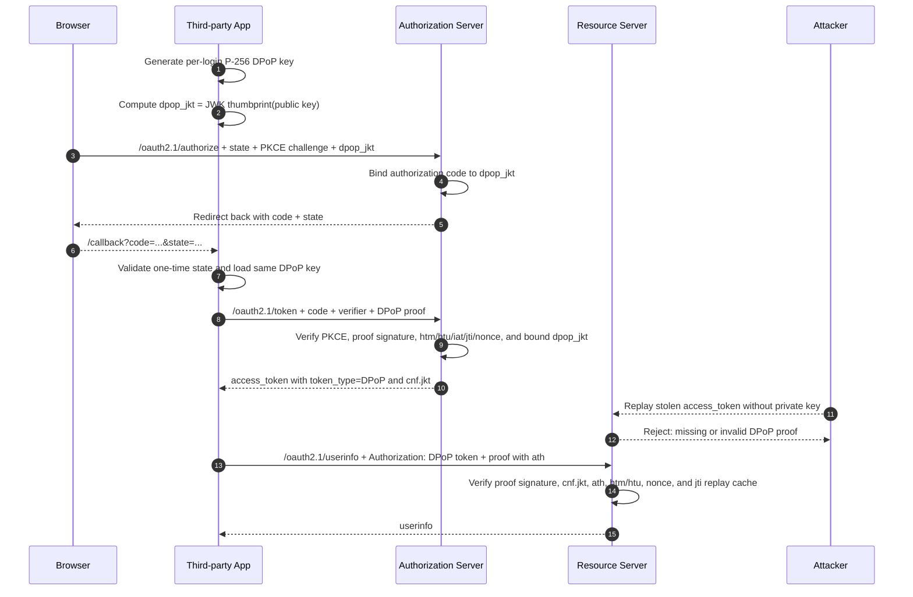

# OAuth2.1 第三方应用示例

这是一个使用 OAuth2.1 授权码流程接入 Common Login Service 的示例应用。OAuth2.1 使用独立生成的 `client_id` / `client_secret`，并强制启用 PKCE S256。示例程序支持 DPoP，会在服务端开启 DPoP 时自动使用 `token_type=DPoP` 调用 userinfo。

示例侧重点是演示当前推荐的 OAuth2.1 + DPoP 组合：固定回调地址、短期 `state`、每次授权请求独立 DPoP key、`dpop_jkt` 授权码绑定、DPoP nonce 重试、带 `ath` 的资源请求 proof，以及签名后的本地 demo cookie。

## 配置

首次运行会生成 `config.json`：

```json
{
  "port": "8083",
  "login_url": "https://your-login-service.com",
  "callback_url": "http://localhost:8083/callback",
  "client_id": "your-oauth21-client-id",
  "client_secret": "your-oauth21-client-secret",
  "enable_dpop": true
}
```

也可以使用环境变量覆盖：

```bash
LOGIN_URL=https://your-login-service.com \
CALLBACK_URL=http://localhost:8083/callback \
CLIENT_ID=your-oauth21-client-id \
CLIENT_SECRET=your-oauth21-client-secret \
ENABLE_DPOP=true \
PORT=8083 \
go run main.go
```

## 获取客户端凭据

1. 登录管理后台。
2. 打开 `开发者 -> OAuth2.1客户端`。
3. 点击“生成客户端和密钥”。
4. 保存生成的 `client_id` 和 `client_secret`，密钥只显示一次。
5. 将客户端回调地址配置为 `callback_url` 的值，例如 `http://localhost:8083/callback`。

## 运行

```bash
go run main.go
```

打开 `http://localhost:8083`，点击“使用 OAuth2.1 登录”。

## 流程

1. Demo 生成 `state`、`code_verifier` 和 `code_challenge`，`state` 默认 10 分钟内有效且只能使用一次。
2. 如果启用 DPoP，Demo 为本次授权请求生成独立 P-256 key，并在授权请求中携带 `dpop_jkt`。
3. 浏览器跳转到 `/oauth2.1/authorize`，请求中包含 `code_challenge_method=S256` 和固定的 `redirect_uri`。
4. 用户登录并授权后，服务端回调 Demo 的 `/callback`。
5. Demo 调用 `/oauth2.1/token`，提交 `client_id`、`client_secret`、`redirect_uri` 和 `code_verifier`；如果启用 `enable_dpop`，请求会额外携带 DPoP proof。
6. 如果授权服务器返回 `DPoP-Nonce` 并要求 `use_dpop_nonce`，Demo 会使用该 nonce 重新生成 proof 并重试一次。
7. 如果响应 `token_type=DPoP`，Demo 使用 `Authorization: DPoP` 和带 `ath` 的 DPoP proof 请求 `/oauth2.1/userinfo`；否则使用 Bearer。
8. userinfo 成功后，Demo 会写入带 HMAC 签名和过期时间的本地 cookie，仅用于首页展示登录结果。

## DPoP 防重放流程

DPoP 的核心目标不是“隐藏 token”，而是把授权码、访问令牌和每一次资源请求都绑定到同一把临时私钥上。攻击者即使截获了授权码或 access token，只要没有这把私钥，就无法生成服务端认可的 proof。



### 每一层挡住什么攻击

| 防护点 | 放在哪里 | 防止什么 |
| --- | --- | --- |
| `state` | 授权请求和 callback | 防 CSRF，防攻击者把自己的授权结果塞进受害者会话 |
| PKCE S256 | `/authorize` + `/token` | 防授权码被截获后直接换 token；攻击者没有 `code_verifier` |
| `dpop_jkt` | `/authorize` | 把授权码绑定到本次登录的 DPoP 公钥 |
| DPoP proof | `/token` | 换 token 时必须证明自己持有 `dpop_jkt` 对应私钥 |
| `cnf.jkt` | access token 内部确认字段 | 资源服务器用它确认 token 只能由同一把 DPoP key 使用 |
| `ath` | userinfo/resource proof | 把 proof 绑定到当前 access token，防 proof 被拿去配另一个 token |
| `jti` | 每个 DPoP proof | proof 唯一 ID；服务端缓存已使用 ID，防同一个 proof 被重复提交 |
| `DPoP-Nonce` | token/userinfo 端点挑战 | 服务端要求 proof 带最新 nonce，防离线预生成 proof 和跨请求重放 |
| `htm` / `htu` | 每个 DPoP proof | proof 只能用于指定 HTTP 方法和 URL，防跨端点复用 |

### 典型攻击如何失败

1. 攻击者截获授权码：没有 `code_verifier`，PKCE 校验失败；即使拿到 verifier，没有 `dpop_jkt` 对应私钥，token endpoint 的 DPoP proof 校验也会失败。
2. 攻击者截获 access token：token 是 DPoP-bound token，资源端会读取 `cnf.jkt`，要求请求携带同一公钥签出的 proof；攻击者没有私钥，所以不能使用 token。
3. 攻击者截获一次合法 userinfo 请求：再次发送同一个 proof 时，`jti` 已被使用会被拒绝；如果服务端要求 nonce，旧 nonce 或缺失 nonce 也会被拒绝。
4. 攻击者把 proof 改到其他接口或方法：`htm` / `htu` 和实际请求不一致，服务端拒绝。
5. 攻击者拿旧 proof 搭配新 token：`ath` 是 access token 的 SHA-256 哈希，和新 token 不匹配，服务端拒绝。

## 安全实践说明

- `callback_url` 应与管理后台注册的 redirect URI 完全一致，避免由请求 Host 动态拼接回调地址。
- `state` 存储在进程内存中，适合本地 demo；多实例或生产环境应改用共享存储并保留 TTL 和一次性消费语义。
- DPoP key 是每次授权请求临时生成的；`dpop_jkt` 将授权码绑定到该 key，token 和 userinfo 请求继续使用同一 key。
- Demo 会区分 token endpoint 和 userinfo endpoint 的 `DPoP-Nonce`，并只对发出 nonce 的端点复用。
- 本地 cookie 只保存展示用用户信息，不是 Common Login Service 的认证凭据；生产环境应使用服务端 session 或更完整的会话管理。
- `client_secret` 可以通过环境变量提供，避免把真实密钥写入 `config.json`。

## 与 OAuth2.0 示例的区别

| 项目 | OAuth2.0 示例 | OAuth2.1 示例 |
| --- | --- | --- |
| 端点 | `/oauth2/*` | `/oauth2.1/*` |
| 客户端身份 | API Token 作为 `client_id` | 独立 `client_id` + `client_secret` |
| PKCE | 不要求 | 必须使用 S256 |
| DPoP | 不支持 | 可选，支持 `dpop_jkt`、`ath` 和 nonce 重试 |
| Demo 端口 | `8082` | `8083` |
