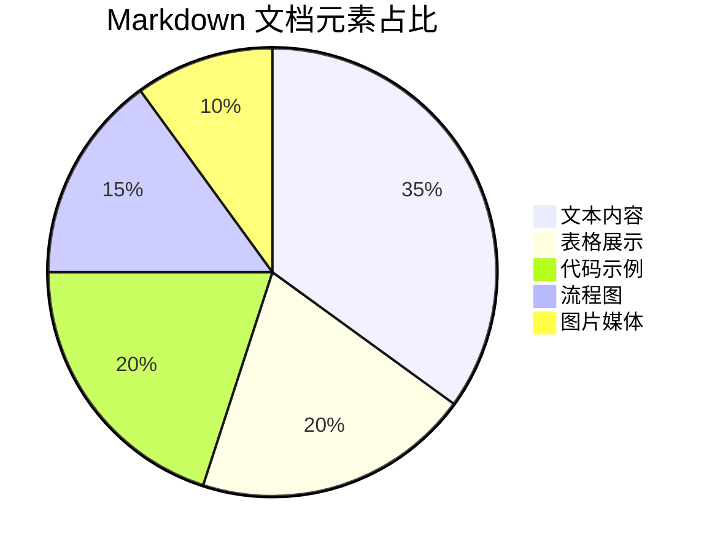
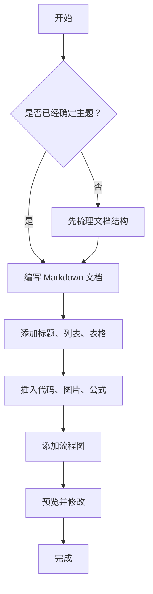
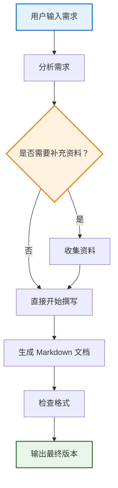
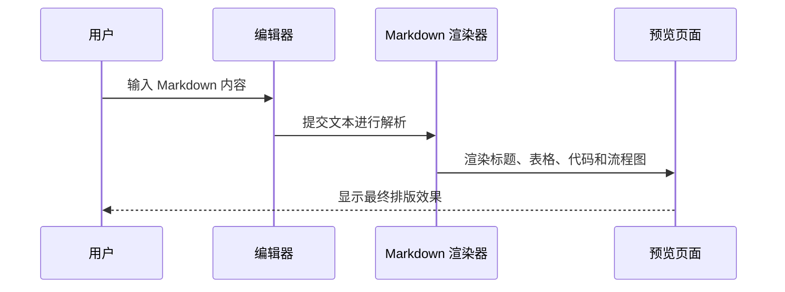
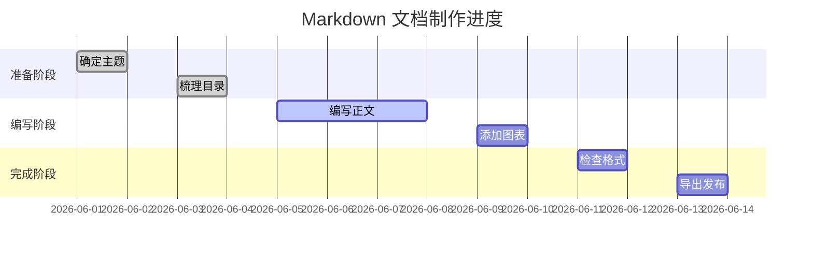
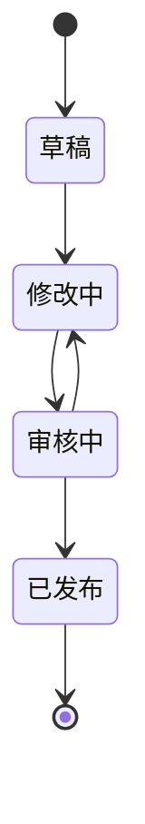

# ✨ Markdown 演示文档（完整版）

**一个集美观排版、快速导航、丰富元素的完整 Markdown 示例**
*欢迎体验 Markdown 的强大表现力！*
--------------------------------

[目录](#目录)

## 📋 目录（快速跳转）

* [1. 文本样式与强调](#1-文本样式与强调)
* [2. 列表演示](#2-列表演示)
* [3. 表格展示](#3-表格展示)
* [4. 代码与高亮](#4-代码与高亮)
* [5. 引用与警示](#5-引用与警示)
* [6. 图片与媒体](#6-图片与媒体)
* [7. 任务清单](#7-任务清单)
* [8. 数学公式与图表](#8-数学公式与图表)
* [9. 流程图演示](#9-流程图演示)
* [10. 折叠内容与分隔线](#10-折叠内容与分隔线)
* [11. 综合排版示例](#11-综合排版示例)
* [返回顶部](#-markdown-演示文档完整版)

---

## 1. 文本样式与强调

**加粗文本**　　*斜体文本*　　***加粗斜体***　　~~删除线~~　　<u>下划线</u>

> 不同**层级**的 *强调* 可以 ***组合*** 使用，创造出更加丰富的视觉效果。

### 小标题示例

#### H4 标题

##### H5 标题

###### H6 标题

### 行内标记

这是一个 `行内代码` 示例，也可以用于突出命令、变量名或关键词。

例如：

* 使用 `npm install` 安装依赖
* 使用 `git status` 查看当前状态
* 使用 `console.log()` 输出调试信息

---

## 2. 列表演示

### 无序列表

* 🌟 第一个项目
  
  * 嵌套子项
    
    * 更深层嵌套
* 🚀 第二个项目
* ✅ 支持 Emoji 增强美观
* 📌 适合用于说明功能点、优点、注意事项

### 有序列表

1. 第一步：打开 Markdown 编辑器
2. 第二步：输入正文内容
3. 第三步：添加标题、列表、表格和代码块
4. 第四步：预览排版效果
5. 第五步：导出为 PDF、HTML 或直接发布

### 混合列表

1. 项目准备
   
   * 明确主题
   * 收集资料
   * 设计结构
2. 内容编写
   
   * 撰写正文
   * 插入图片
   * 添加表格
3. 后期优化
   
   * 检查格式
   * 调整标题层级
   * 优化阅读体验

---

## 3. 表格展示

| 功能   | 支持情况  | 美观度   | 备注            |
| ---- | ----- | ----- | ------------- |
| 表格   | ✅ 原生  | ★★★★★ | 自动对齐          |
| 快速跳转 | ✅ 支持  | ★★★★★ | TOC + 锚点      |
| 响应式  | ✅ 优秀  | ★★★★☆ | 移动端友好         |
| 颜色支持 | 🔶 扩展 | ★★★★★ | 通过 HTML 或主题实现 |
| 代码高亮 | ✅ 支持  | ★★★★★ | 多语言代码块        |
| 流程图  | 🔶 扩展 | ★★★★★ | Mermaid 支持较好  |

### 对齐演示

| 左对齐  |  居中对齐  |   右对齐 |
| :--- | :----: | ----: |
| 项目 A | 数据 123 |  99.9 |
| 项目 B | 数据 456 | 100.0 |
| 项目 C | 数据 789 | 88.88 |

### 复杂表格示例

| 模块 | 说明           | 推荐使用场景     |
| -- | ------------ | ---------- |
| 标题 | 用 `#` 表示不同层级 | 文档结构划分     |
| 列表 | 支持有序和无序列表    | 步骤说明、功能点展示 |
| 表格 | 用于结构化展示数据    | 参数对比、信息汇总  |
| 引用 | 用 `>` 表示引用内容 | 说明、提示、摘录   |
| 代码 | 用反引号包裹       | 技术文档、程序示例  |

---

## 4. 代码与高亮

### 行内代码

使用 `console.log("Hello Markdown!")` 可以在 JavaScript 中输出内容。

### Python 代码块

```python
# Python 示例
def beautiful_markdown():
    print("✨ Markdown 让文档变得优雅！")
    return "美观 + 高效"

result = beautiful_markdown()
print(result)
```

### JavaScript 代码块

```javascript
// JavaScript 示例
function sayHello(name) {
  return `Hello, ${name}!`;
}

console.log(sayHello("Markdown"));
```

### HTML 代码块

```html
<div class="card">
  <h3>Markdown + HTML</h3>
  <p>部分 Markdown 编辑器支持直接嵌入 HTML。</p>
</div>
```

### Shell 命令示例

```bash
# 初始化项目
npm init -y

# 安装依赖
npm install

# 启动项目
npm run dev
```

---

## 5. 引用与警示

### 普通引用

> Markdown 的优势在于语法简单、结构清晰、兼容性强，适合写说明文档、项目文档、学习笔记和技术博客。

### 多层引用

> 第一层引用
> 
> > 第二层引用
> > 
> > > 第三层引用

### 警示块示例

> [!NOTE]
> 这是一个普通提示，用于补充说明信息。

> [!TIP]
> 这是一个技巧提示，用于告诉读者更高效的做法。

> [!IMPORTANT]
> 这是重要信息，建议读者重点关注。

> [!WARNING]
> 这是警告内容，表示可能存在风险或需要谨慎操作。

> [!CAUTION]
> 这是更强烈的提醒，通常用于避免错误操作。

---

## 6. 图片与媒体

### 图片示例

```markdown

```


实际显示效果：


### 带说明的图片

> 图 1：这是一张用于演示 Markdown 图片插入效果的占位图。

### 图片链接

点击图片可以跳转到指定页面：

[](https://www.markdownguide.org/)

### 视频链接示例

Markdown 通常不直接嵌入视频，但可以放置视频链接：

[点击观看示例视频](https://www.example.com)

也可以使用 HTML 标签嵌入视频：

```html
<video controls width="600">
  <source src="video.mp4" type="video/mp4">
  您的浏览器不支持 video 标签。
</video>
```

---

## 7. 任务清单

### 项目任务清单

* [x] 完成文档标题
* [x] 添加目录导航
* [x] 补全文本样式
* [x] 添加表格展示
* [x] 添加代码块
* [x] 添加引用和警示
* [x] 添加图片与媒体
* [x] 添加任务清单
* [x] 添加数学公式
* [x] 添加流程图
* [ ] 导出 PDF
* [ ] 发布到文档平台

### 学习计划示例

* [x] 学习 Markdown 基础语法
* [x] 掌握标题、列表、表格
* [ ] 学习 Mermaid 流程图
* [ ] 学习 Markdown 转 PDF
* [ ] 搭建个人知识库

---

## 8. 数学公式与图表

> 数学公式通常依赖编辑器对 LaTeX 的支持，例如 Typora、Obsidian、Notion、GitHub 部分场景等。

### 行内公式

这是一个行内公式：$E = mc^2$

### 块级公式

$$
a^2 + b^2 = c^2
$$

### 求和公式

$$
S_n = \sum_{i=1}^{n} i = \frac{n(n+1)}{2}
$$

### 分数与根号

$$
x = \frac{-b \pm \sqrt{b^2 - 4ac}}{2a}
$$

### Mermaid 饼图示例



### Mermaid 柱状图替代表达

Mermaid 本身不直接支持传统柱状图，但可以用流程图或表格进行近似表达：

| 类型  | 使用频率            |
| --- | --------------- |
| 标题  | ██████████ 100% |
| 列表  | █████████ 90%   |
| 表格  | ████████ 80%    |
| 代码  | ███████ 70%     |
| 流程图 | ██████ 60%      |

---

## 9. 流程图演示

> 以下流程图使用 Mermaid 语法，需要 Markdown 编辑器支持 Mermaid 渲染。

### 基础流程图



### 横向流程图


### 带颜色样式的流程图



### 时序图示例



### 甘特图示例



### 状态图示例



---

## 10. 折叠内容与分隔线

### 折叠内容

<details>
<summary>点击展开更多内容</summary>

这里是被折叠起来的内容。

可以放置：

* 文字说明
* 表格
* 代码
* 图片
* 链接

```javascript
console.log("这是折叠区域中的代码");
```

</details>

### 分隔线

下面是三种常见分隔线写法：

---

---

---

---

## 11. 综合排版示例

### 项目介绍

本项目旨在展示 Markdown 在文档编写、项目说明、学习笔记、技术博客和产品文档中的应用效果。通过标题、列表、表格、代码、图片、公式和流程图等元素，可以快速构建一份结构清晰、排版美观、便于维护的文档。

### 项目优势

| 优势   | 说明                     |
| ---- | ---------------------- |
| 语法简单 | 不需要复杂排版软件即可完成文档编写      |
| 结构清晰 | 标题层级明确，适合长文档组织         |
| 易于转换 | 可导出为 HTML、PDF、Word 等格式 |
| 兼容性强 | 多数编辑器和代码平台都支持          |
| 适合协作 | 纯文本格式，便于版本管理           |

### 推荐使用场景

* 项目 README 文档
* 技术博客
* 学习笔记
* 产品说明书
* 接口文档
* 会议纪要
* 课程讲义
* 演示文档

### 示例总结

> Markdown 的核心价值在于：用简单的符号表达清晰的结构，用轻量的语法完成专业的排版。

---

## ✅ 结语

通过这份文档，你已经看到了 Markdown 的常见能力：

* 文本样式
* 标题层级
* 列表结构
* 表格展示
* 代码高亮
* 引用提示
* 图片媒体
* 任务清单
* 数学公式
* Mermaid 流程图
* 折叠内容
* 综合排版

**Markdown 不只是写文字，更是一种高效、清晰、优雅的内容组织方式。**

---

* [返回顶部](#1-文本样式与强调)